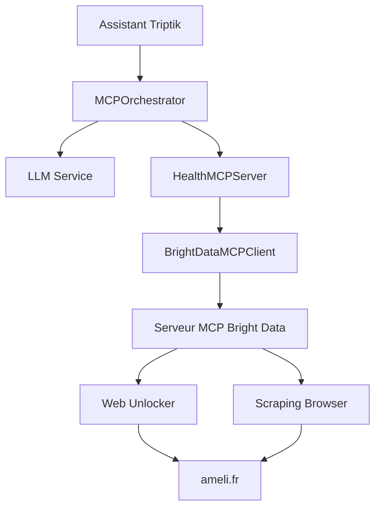

# Configuration Bright Data MCP

## 🎯 Vue d'ensemble

L'assistant utilise maintenant le **serveur MCP officiel de Bright Data** au lieu d'un client custom. Cette approche offre :

- ✅ **Stabilité** : Serveur officiel maintenu par Bright Data
- ✅ **Performance** : Optimisations natives pour le scraping
- ✅ **Fiabilité** : Gestion avancée des erreurs et retry
- ✅ **Fonctionnalités** : Accès à tous les outils Bright Data

## 📋 Configuration requise

### 1. **Credentials Bright Data**
```env
BRIGHT_DATA_API_TOKEN=481767225aa68d17aeadaca63bb1ebd4c20fb25f7a9e1ad459d0676910cc62e7
BRIGHT_DATA_WEB_UNLOCKER_ZONE=web_unlocker1
BRIGHT_DATA_BROWSER_AUTH=brd-customer-hl_b189d2cb-zone-scraping_browser1:l83vao83g80i
```

### 2. **Configuration LLM**
```env
LLM_PROVIDER=openai
LLM_API_KEY=sk-your-openai-key-here
LLM_MODEL=o4-mini-2025-04-16
```

## 🚀 Installation

### Méthode 1 : Script automatique
```bash
node scripts/install-bright-data-mcp.js
```

### Méthode 2 : Installation manuelle
```bash
npm install -g @brightdata/mcp
```

### Méthode 3 : Utilisation avec npx (sans installation)
Le système utilise automatiquement `npx @brightdata/mcp` si le package n'est pas installé globalement.

## 🏗️ Architecture



## 🔧 Composants principaux

### **BrightDataMCPClient** (`lib/mcp/bright-data-mcp-client.ts`)
- Gère la communication avec le serveur MCP Bright Data
- Démarre automatiquement le processus `npx @brightdata/mcp`
- Protocole JSON-RPC 2.0 pour la communication

### **HealthMCPServer** (`lib/mcp/health-server.ts`)  
- Orchestrateur principal pour les requêtes santé
- Utilise le client MCP pour le scraping ameli.fr
- Cache intelligent des résultats

### **MCPOrchestrator** (`lib/mcp/mcp-orchestrator.ts`)
- Combine LLM + MCP pour les conversations
- 4 outils disponibles pour le LLM
- Gestion des contextes de conversation

## 🛠️ Outils disponibles

### 1. **`search_ameli_health`**
Recherche intelligente sur ameli.fr
```typescript
await orchestrator.processUserMessage(
  "Comment obtenir ma carte vitale ?",
  context
)
```

### 2. **`scrape_specific_ameli_page`**
Scraping d'une page spécifique
```typescript
await mcpClient.scrapeAsMarkdown("https://www.ameli.fr/assure/droits-demarches/carte-vitale")
```

### 3. **`search_engine`**
Recherche sur Google/Bing/Yandex
```typescript
await mcpClient.searchEngine("site:ameli.fr carte vitale", "google")
```

### 4. **`get_health_suggestions`**
Suggestions personnalisées selon le profil utilisateur

## 🔍 Débogage

### Logs du serveur MCP
```bash
# Les logs apparaissent dans la console Next.js
# Recherchez "MCP stderr:" pour les erreurs
```

### Test de connexion
```typescript
const isConnected = await healthServer.testConnection()
console.log('Connexion Bright Data:', isConnected)
```

### Vérification des outils disponibles
```typescript
const tools = await mcpClient.getAvailableTools()
console.log('Outils MCP disponibles:', tools)
```

## ⚠️ Dépannage

### Erreur "Processus MCP non initialisé"
```bash
# Vérifier l'installation
npx @brightdata/mcp --version

# Réinstaller si nécessaire
npm install -g @brightdata/mcp
```

### Erreur de credentials
```bash
# Vérifier les variables d'environnement
echo $BRIGHT_DATA_API_TOKEN
echo $BRIGHT_DATA_WEB_UNLOCKER_ZONE
echo $BRIGHT_DATA_BROWSER_AUTH
```

### Timeout des requêtes
- Le timeout par défaut est de 30 secondes
- Modifiable dans `BrightDataMCPClient.sendMCPRequest()`

## 📊 Monitoring

### Statistiques du cache
```typescript
const stats = healthServer.getCacheStats()
console.log('Cache stats:', stats)
```

### Santé du système
```typescript
const health = await healthServer.getSystemHealth()
console.log('System health:', health)
```

## 🔄 Migration depuis l'ancien client

L'ancien `BrightDataClient` a été remplacé par `BrightDataMCPClient`. Les principales différences :

- ✅ **Protocole MCP** : Communication standardisée
- ✅ **Processus séparé** : Isolation et stabilité
- ✅ **Outils intégrés** : Accès à tous les outils Bright Data
- ✅ **Gestion d'erreur** : Retry automatique et fallbacks

## 📚 Ressources

- [Documentation Bright Data MCP](https://docs.brightdata.com/mcp)
- [Protocole MCP](https://modelcontextprotocol.io/)
- [Configuration ameli.fr](./MCP_ARCHITECTURE.md) 